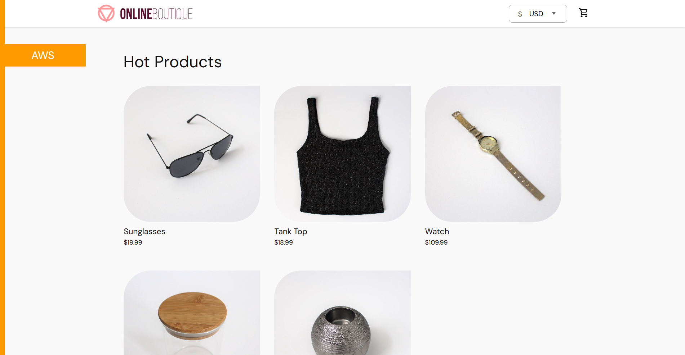
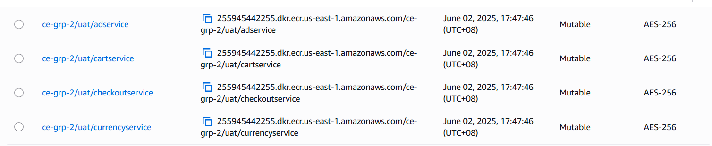
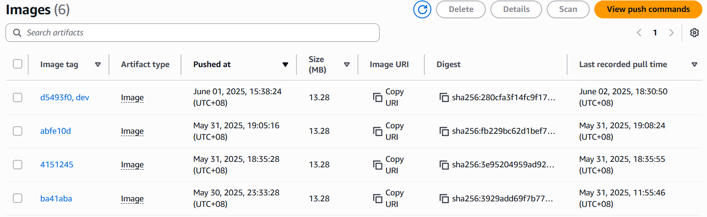
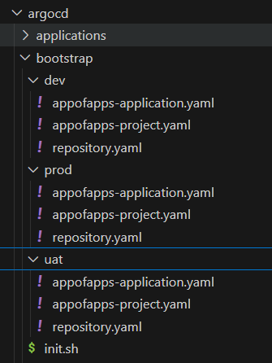
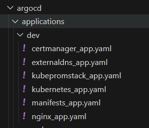
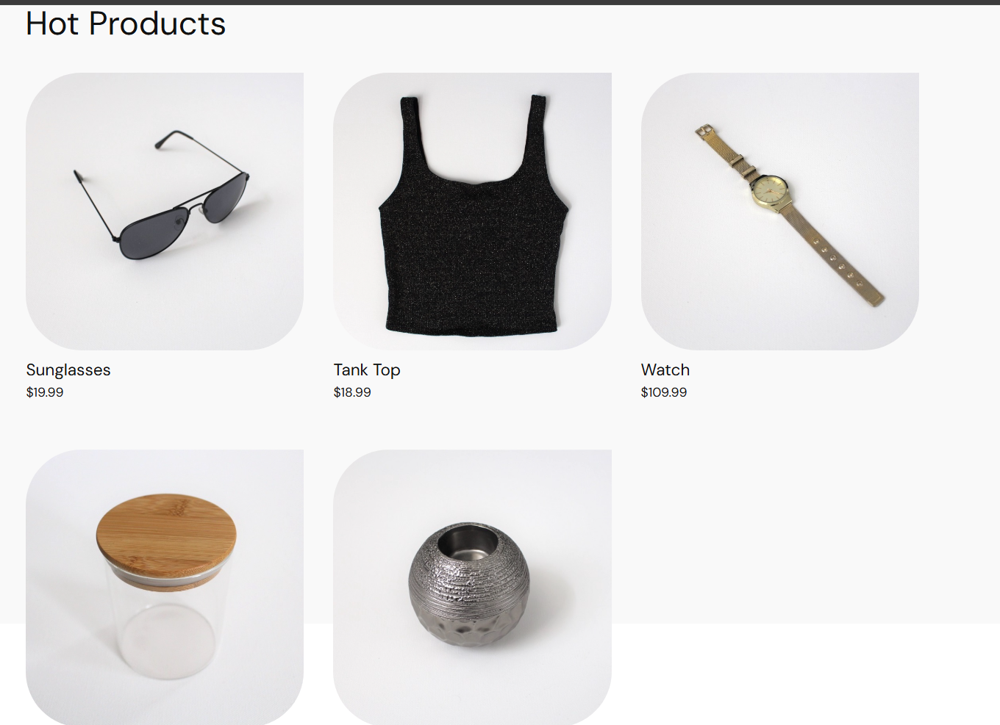
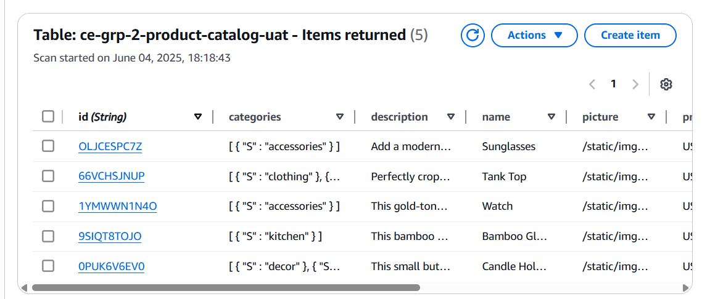
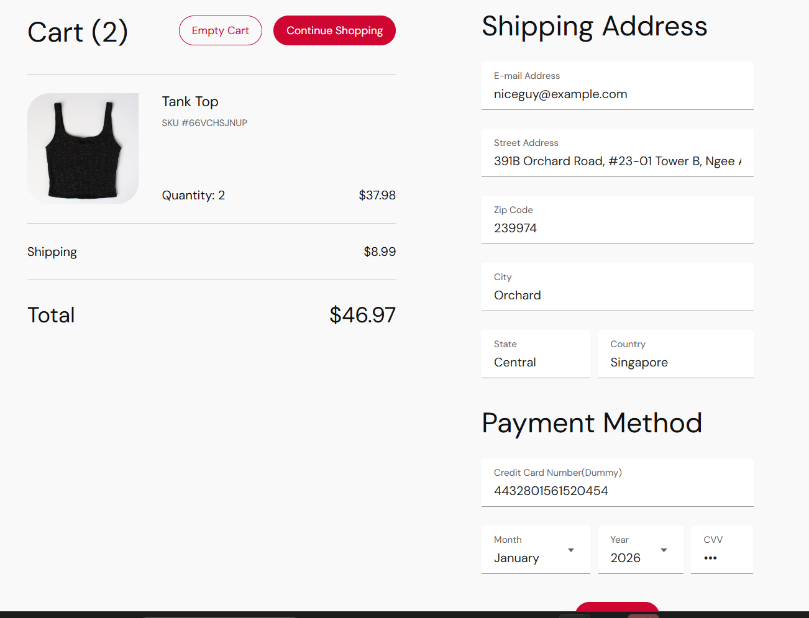
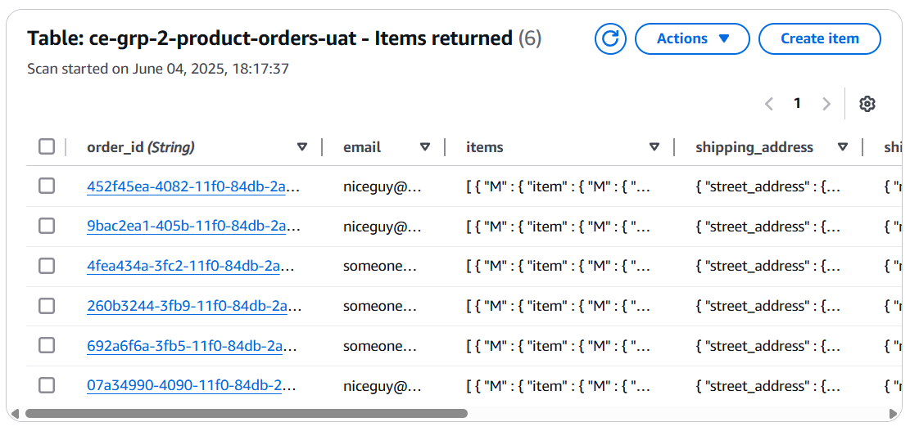
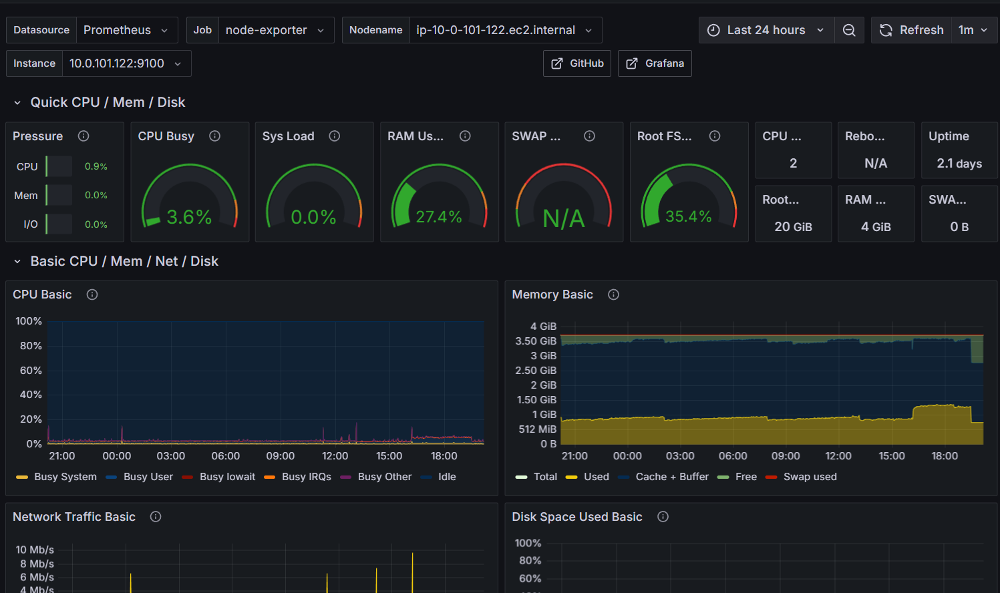

# SCTP-CE9-Group 2 Capstone Project

## Overview

Our Capstone project aims to design, deploy and manage an e-commerce microservice application on an Amazon Elastic Kubernetes Cluster, using proper CI/CD pipelines. It also includes basic observability using Prometheus for monitoring system performance.

You can find our Capstone project here:

https://ce-grp-2-capstone-uat.sctp-sandbox.com/

## Microservice Application

<figure>
  
</figure>

We are using [Google's Microservice Demo](https://github.com/GoogleCloudPlatform/microservices-demo) as the application to deploy on our cluster. It is a web-based e-commerce app where users can browse items, add them to the cart, and purchase them. However we have added on our own features to enhance this app.

## Architecture Diagram

""

## Infrastructure

The repository for our infrastructure code can be found here: https://github.com/Kento555/Capstone-Project-Group2-Infra

It will create the necessary resources for us to deploy our application:
  - VPC with subnets, gateways 
  - EKS Cluster with managed nodegroups and security groups
  - IAM roles for IRSA
  - DynamoDB databases, Lambda function, Eventbridge for storing data
  - ECR repositories for storing container images

The infrastructure is automated using GitHub Actions and Terraform code.

## Building and Pulling Images from ECR

<figure>
  
</figure>

Due to having to modify some of the application's code for certain features to work, we rebuilt the container images and pushed them to our own ECR repositories. Then we changed the application's helm chart to pull from our ECRs for the images instead.

Our Github Action ["Build and Push Microservices to ECR"](https://github.com/Kento555/Capstone-Project-Group2-App/blob/main/.github/workflows/build-scan-and-push.yml) will automate the building of images from our [sources](https://github.com/Kento555/Capstone-Project-Group2-App/tree/main/src) folder and push them to our ECR repositories. 

<figure>
  
</figure>

## GitOps and ArgoCD (CI/CD Pipeline)

<figure>
  
</figure>

To automate the deployment of ArgoCD and all of our applications, we use our Github Action ["Install ArgoCD and Apply Environment Manifests"](https://github.com/Kento555/Capstone-Project-Group2-App/blob/main/.github/workflows/install-argocd.yaml). The action will run the [init.sh](https://github.com/Kento555/Capstone-Project-Group2-App/blob/main/argocd/bootstrap/init.sh) file in the bootstrap folder that will run all the application files in the specified environment. In addition, we used a appofapps manifest to watch and automate the creation of applications in another folder.

<figure>
  
</figure>

## DNS & HTTPS

To enable our application to have a DNS name with HTTPS enabled and TLS-certified, the following resources are required:

<table border="1">
    <tr>
        <th align="center">Resource</th>
        <th align="center" width="500">Description</th>
    </tr>
    <tr>
        <td align="center">
          <a href="https://github.com/kubernetes-sigs/external-dns" target="_blank">
              External-DNS
            </a>
          </td>
        <td align="center">Makes Kubernetes resources discoverable via public DNS servers</td>
    </tr>
    <tr>
        <td align="center">
          <a href="https://github.com/kubernetes/ingress-nginx" target="_blank">
              Ingress NGInx Controller
            </a>
          </td>
        <td align="center">Ingress controller for Kubernetes using NGINX as a reverse proxy and load balancer</td>
    </tr>
    <tr>
        <td align="center">
          <a href="https://github.com/cert-manager/cert-manager" target="_blank">
              Cert-manager
            </a>
          </td>
        <td align="center">Adds certificates and certificate issuers as resource types in Kubernetes clusters</td>
    </tr>
</table>

With these resources, we are able to deploy an Ingress and a Cluster Issuer to create our DNS on Route 53 with HTTPS enabled.

## Product Catalog and Checkout Service

Originally, the application hosted the information of its product catalog locally, and the checkout details could not be saved upon the end of a session. We have modified them to suit our own needs.

<figure>
   
</figure>

<figure>
   
</figure>

Here, we can control the items we want to display in our store page, using DynamoDB to store data of our products. We also used CloudFront to store and deliver the images of our products to our users.

<figure>
   
</figure>

<figure>
   
</figure>

We have also modified the app to send the data of any checkout orders into our other DynamoDB here, using EventBridge, SQS Messaging Service and Lambda to do so.

## Monitoring

Using [kube prometheus stack](https://github.com/prometheus-community/helm-charts/tree/main/charts/kube-prometheus-stack), we are able to use the following for monitoring:

<table border="1">
    <tr>
        <th align="center">Resource</th>
        <th align="center" width="500">Description</th>
    </tr>
    <tr>
        <td align="center">
            Prometheus
          </td>
        <td align="center">Collect metrics from services</td>
    </tr>
    <tr>
        <td align="center">
              Alert Manager
          </td>
        <td align="center">Set up alerts to trigger for certain events when they occur</td>
    </tr>
    <tr>
        <td align="center">
              Grafana
          </td>
        <td align="center">Visualize all collected data and metrics</td>
    </tr>
</table>

<figure>
  
</figure>

Unfortunately, the application's deployments do not expose metrics by default, and thus we have chosen to monitor the state of the nodes instead using Node Exporter.

## FUTURE ENHANCEMENTS

- **Autoscaling:** use HPA for pod autoscaling, and install Cluster Autoscaler for node autoscaling
- **Enhanced Observability:** Add on Loki and Grafana Alloy for logging, and use AWS X-ray for tracing 

## BRANCHING STRATEGY AND PERMISSIONS

- Trunk-based development style, with each person making commits on their own feature branch then making a pull request to main branch 
- Main branch is protected from any direct pushes and requires at least one other person in the team to approve the changes. 

## MEMBERS

- Kong Wei Shen
- Norman Fung Zi Jie
- Tan Ke Yang
- Nabilah Huda Tang Jun Xia
- Chris Yeo Hsi Chieh